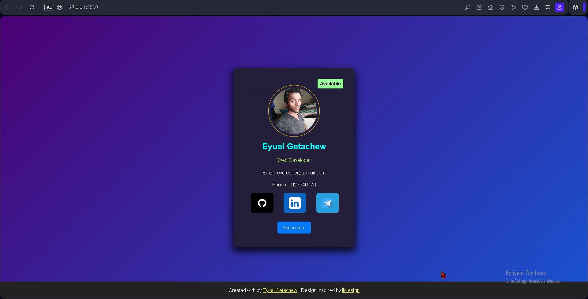

# Profile Card

This project features a responsive profile card created using HTML, CSS, and JavaScript. The card displays personal information, contact details, and social media links with an attractive tricolor gradient background.

## Features

- Responsive design for various screen sizes
- Interactive card flip effect to reveal more information
- Dynamic tricolor gradient background that enhances aesthetics
- Easy-to-customize layout for personal or professional use

## Technologies Used

- HTML5
- CSS3(no preprocessor used)
- JavaScript
- Google Fonts for typography

## Preview



## Getting Started

To get a local copy up and running, follow these simple steps:

     **Clone the repository:**

```bash
git clone https://github.com/yourusername/profile-card.git
```

## Contributing

Contributions are welcome! If you have suggestions for improvements or features, please fork the repository and create a pull request.

## License

This project is licensed under the MIT License. See the LICENSE file for more details.

## Author

Created by **Eyuel Getachew**

## Acknowledgments

Inspired by various UI designs and tutorials available on platforms like Dribbble and CodePen.
Special thanks to the open-source community for their resources and documentation.
